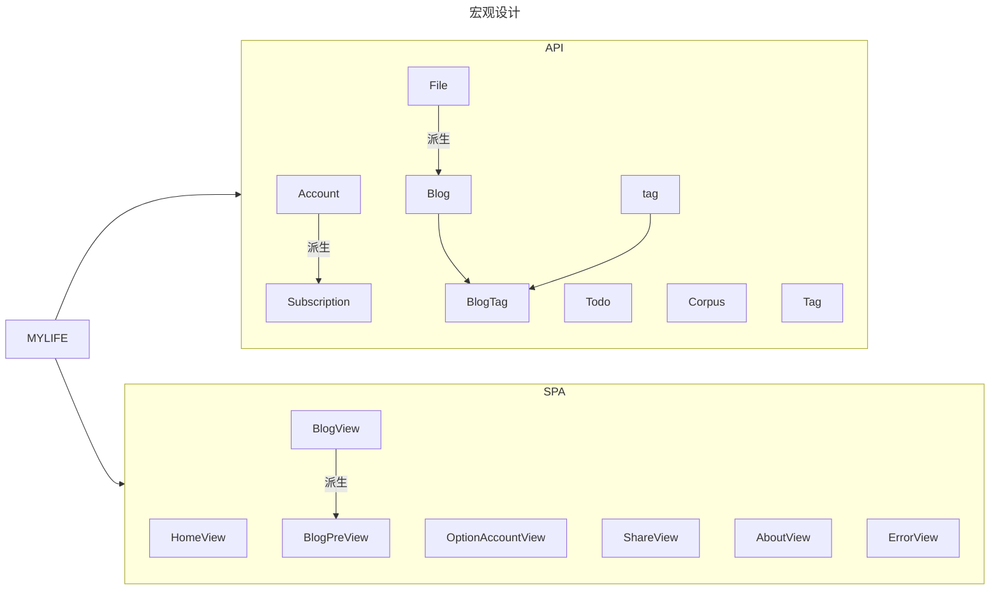
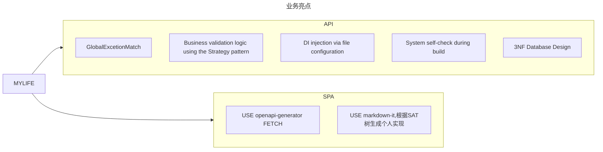

# 项目结构





## 前端待办

- [ ] 完善 OptionAccount (仍在考虑优化)
- [x] 添加 Blog 详情页（即 Markdown 文档渲染器组件）
- [ ] 设计时间线组件

## 后端待办

- [ ] 持续优化业务代码
- [ ] 追加 Blog 业务
- [ ] 追加 业务流程控制
- [ ] 重写所有业务流程,使用统一业务流

## 业务流程

```mermaid
gantt
    title 用户完整注册流程
    dateFormat  SSS
    axisFormat %Sms
    
    section 注册基础信息的账户
    参数校验      :a1, 0, 10s
    执行服务      :a2, after a1, 15s
    
    自动登录: milestone,0s

    section 上传账户配置文件
    参数校验  :b1 ,after a2, 10s
    执行服务      :b2, after b1, 15s

    section 更新账户配置
    参数校验      :c1, after b2, 10s
    执行服务      :c2, after c1, 15s
    
    section 查询
    查询注册账户信息 :done, merge, after c2, 12s
```



### DI 生命周期

OnTokenValidated 是在运行时跑的，为什么 IHttpContextAccessor 还是拿不到用户？这就是 JWT 身份验证中间件内部的执行序列 导致的：
- 接收请求：中间件截获了你带 Token 的请求。
- 解密与验证：中间件成功验证了 Token 的签名、有效期等。
- 触发 OnTokenValidated（你写代码的地方）：验证通过后，中间件会立即调用这个钩子。注意：此时中间件虽然知道你是谁（数据在 context.Principal 里），但它还没有把这个身份正式“任命”给 httpContext.User。
- 赋值 (Assignment)：只有当你的 OnTokenValidated 逻辑执行完毕并返回“成功”后，中间件才会执行最后一步：httpContext.User = context.Principal;。
- 后续管道：此后，请求才会流向 Authorize 拦截器和 Controller。

结论：你在 OnTokenValidated 内部通过 IHttpContextAccessor 去找 User，就像是在接线员还没把电话转接到分机前，你就去分机提听筒，自然只能拿到一个“未授权”的空对象。

## Monorepo

```txt
├── apps/
│   ├── web/                 # 游客端 Vue
│   ├── mgs/                 # 管理端 Vue
├── services/
│   └── api/                # C# ASP.NET API
├── packages/
│   ├── api-contract/       # ⭐ OpenAPI契约（核心）
│   ├── api-client/         # ⭐ fetch封装 + DTO映射
│   ├── domain/             # ⭐ 业务模型（前端核心）
│   ├── ui-kit/             # ⭐ 可选：共享UI组件
│   ├── icons/              # ⭐ icon registry
├── tools/
│   ├── openapi-generator/  # 生成脚本
│   ├── ci/
│   ├── scripts/
├── config/
│   ├── eslint/
│   ├── tsconfig/
│   ├── vite/
```

### Packages

#### api-client : 封装与拦截

统一拦截器：在这里处理 JWT Token 的自动注入，以及对 401/403 状态码的统一重定向逻辑 [cite: 127, 217]。
错误映射：将后端抛出的 OperateRequestException（400）或 BusinessException 映射为前端可读的提示 [cite: 216, 222]。

#### api-contract : 契约即真理

后端驱动契约：利用 C# API 项目中已有的 Swagger/OpenAPI 定义，通过工具（如 Swashbuckle.AspNetCore）在编译时生成 swagger.json [cite: 110, 116]。
共享 DTO 定义：你之前在 MyLife.Shared 中定义的 TagDto、AccountDto 等模型，应该通过 OpenAPI 转换为 TypeScript 接口存放在此处 [cite: 181, 184]。这样当你在 C# 中修改字段时，前端会立即收到 TS 类型错误的提醒。

#### domain : 前端的“影子业务层”

业务逻辑校验：例如“用户名合法性检查”、“文件后缀匹配”等逻辑。这些逻辑应与后端 IUploadCheckStrategy 中的规则保持同步，实现“前端先校验，后端后把关”的双重防线 [cite: 43, 45, 131]。
状态转换：将原始 API 返回的数据转换为 UI 需要的格式（View Model）。

icons : 存储所有的svg图像