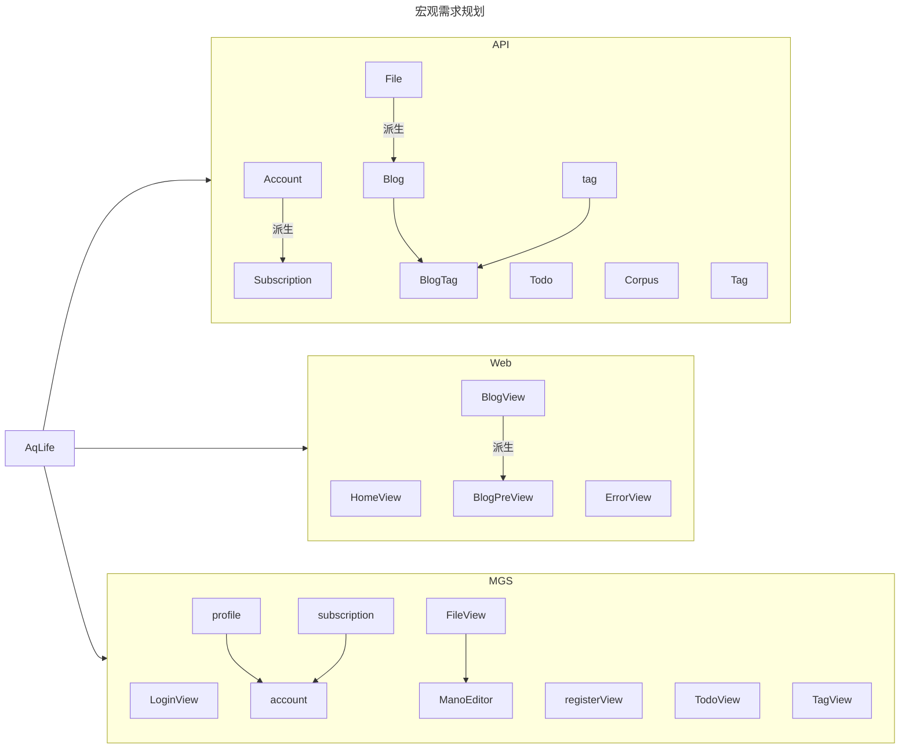

# 项目结构

## 如何运行该项目

项目依赖:

- Node v24+
- NET 8
- Mysql 8.0.X

```shell
## 从0开始
## 第一步创建一个数据库,并同步创建一个程序账户,完成授权
CREATE DATABASE aqlife;-- 此时数据库名称对应 NET 数据库连接字符串,也可以修改
CREATE USER 'ubuntu'@'%' IDENTIFIED BY '密码';-- 创建 NET 程序数据库账户
GRANT ALL PRIVILEGES ON `aqlife`.* TO 'ubuntu'@'%'; -- 授权aqlife 数据库所有权限给 ubuntu 账户(本地访问)
FLUSH PRIVILEGES;-- 更新权限

## 第二步 创建你自己的程序配置文件
cp services/API/Web/Configurations/appsettings.Development.example.json services/API/Web/Configurations/appsettings.Development.json
## ! 请编辑这个文件,添加你的数据库链接字符串,JWT[可选]


## 第三步完成 CodeFrist 生成,将数据模型迁移至 Mysql 数据库
dotnet ef database update --project .\services\API\Infrastructure\Infrastructure.csproj --startup_project .\services\API\Web\Web.csproj
## 这里是示例,请根据实际部署路径修改

## 以Dev模式启动

### 启动 API服务器
dotnet run --project .\services\API\Web\Web.csproj
### 启动游客端
npm run dev:web
### 启动 管理端
npm run dev:mgs

```

> 对于product 模式的,请等待后续 Releases

## 项目概述



## 项目特点

API

- 全局异常: 通过定义异常类,配合前置的校验管线实现Fast Fail,并根据异常类型的内部属性确定 HttpStatusCode,并将友好错误返回给前端
- 模仿 Fluent Vaild 库,以策略模式实现的验证器方案,允许DI注入,使用便捷,易于扩展,和 前置校验管线 有高效的耦合,各个需求(Account/File/Tag/Todo)都有对应的策略模式的Search 方案,同样支持DI注入,易于扩展
- 廋 Controller : 通过引入 MediatR ,将 Controller 大幅瘦身
- Env Self-Check : 在Program 启动阶段增加 DbContext / File存储以及配置 的自检,若自检失败不会允许运行并计入日志,提供运维的可维护性
- 快速上传: 对文件的每次上传都计算其hash,若命中数据库记录,则直接返回对应的数据ID,若没有则上传,通过UploadContext实现

MGS & Web

- 使用 Markdown-It 对后端Md 文件进行转换,将 AST 组件树 通过遍历转为自己实现的组件树,若我没有实现,则使用MARKDOWN-it的组件树进行渲染.
- 使用 Mano Editor 作为 md 的实时编辑器,VScode 同源方案,快速易用
- 通过 Element-plus 的 Step 组件实现账户注册功能,流程化引导,简单易用
- 使用 openapi-generator 对NET  WEB API进行自动生成 FETCH的请求 方法,可随后端更新,并能提供后端数据模型的定义,便于前端使用TS 进行类型检查,提升工程化开发的可靠性

Other

- 提供简单 CI/CD 检查,保障Commit 有效性
- 预构 单元测试,提供API 可信度,后期引入 集成测试
- Monorepo 单体项目,B/S架构,约束 MGS & WEB 前端项目的TS 规范和语法,并提供统一的Npm包支持,减少单项目的npm 滥用

## 业务流程

```mermaid
gantt
    title 用户完整注册流程
    dateFormat  SSS
    axisFormat %Sms
    
    section 注册基础信息的账户
    参数校验      :a1, 0, 10s
    执行服务      :a2, after a1, 15s
    
    自动登录: milestone,0s

    section 上传账户配置文件
    参数校验  :b1 ,after a2, 10s
    执行服务      :b2, after b1, 15s

    section 更新账户配置
    参数校验      :c1, after b2, 10s
    执行服务      :c2, after c1, 15s
    
    section 查询
    查询注册账户信息 :done, merge, after c2, 12s
```



## Monorepo

```txt
├── apps/
│   ├── web/                 # 游客端 Vue
│   ├── mgs/                 # 管理端 Vue
├── services/
│   └── api/                # C# ASP.NET API
├── packages/
│   ├── api-contract/       # ⭐ OpenAPI契约（核心）
│   ├── api-client/         # ⭐ fetch封装 + DTO映射
│   ├── domain/             # ⭐ 业务模型（前端核心）
│   ├── ui-kit/             # ⭐ 可选：共享UI组件
│   ├── icons/              # ⭐ icon registry
├── tools/
│   ├── openapi-generator/  # 生成脚本
│   ├── ci/
│   ├── scripts/
├── config/
│   ├── eslint/
│   ├── tsconfig/
│   ├── vite/
```

### Packages

#### api-client : 封装与拦截

统一拦截器：在这里处理 JWT Token 的自动注入，以及对 401/403 状态码的统一重定向逻辑 。
错误映射：将后端抛出的 OperateRequestException（400）或 BusinessException 映射为前端可读的提示 。

#### api-contract : 契约即真理

后端驱动契约：利用 C# API 项目中已有的 Swagger/OpenAPI 定义，通过工具（如 Swashbuckle.AspNetCore）在编译时生成 swagger.json 。
共享 DTO 定义：之前在 AqLife.Shared 中定义的 TagDto、AccountDto 等模型，通过 OpenAPI 转换为 TypeScript 接口存放在此处 。这样当在 C# 中修改字段时，前端会快速收到 TS 类型错误的提醒。

#### domain : 前端的“影子业务层”

业务逻辑校验：例如“用户名合法性检查”、“文件后缀匹配”等逻辑。这些逻辑与后端 IUploadCheckStrategy 中的规则保持同步，实现“前端先校验，后端后把关”的双重防线。
状态转换：将原始 API 返回的数据转换为 UI 需要的格式（View Model）。

icons : 存储所有的svg图像