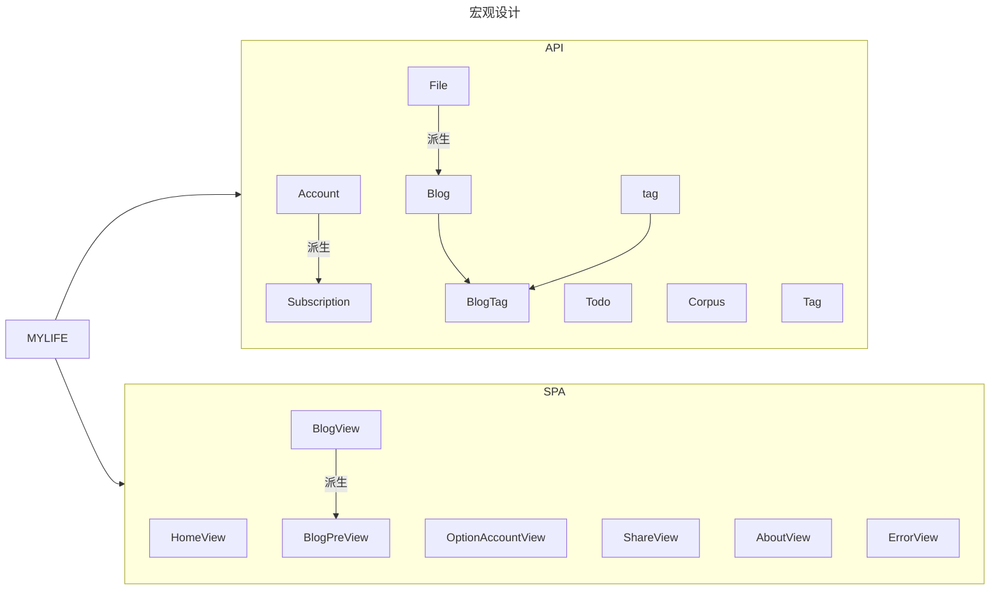
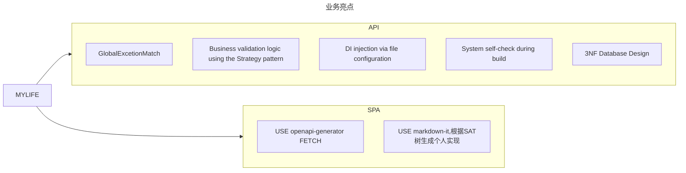

# 项目结构





## 前端待办

- [ ] 完善 OptionAccount (仍在考虑优化)
- [x] 添加 Blog 详情页（即 Markdown 文档渲染器组件）
- [ ] 设计时间线组件

## 后端待办

- [ ] 持续优化业务代码
- [ ] 追加 Blog 业务
- [ ] 追加 业务流程控制
- [ ] 重写所有业务流程,使用统一业务流

## 业务流程

```mermaid
gantt
    title 用户完整注册流程
    dateFormat  SSS
    axisFormat %Sms
    
    section 注册基础信息的账户
    参数校验      :a1, 0, 10s
    执行服务      :a2, after a1, 15s
    
    自动登录: milestone,0s

    section 上传账户配置文件
    参数校验  :b1 ,after a2, 10s
    执行服务      :b2, after b1, 15s

    section 更新账户配置
    参数校验      :c1, after b2, 10s
    执行服务      :c2, after c1, 15s
    
    section 查询
    查询注册账户信息 :done, merge, after c2, 12s
```



### DI 生命周期

OnTokenValidated 是在运行时跑的，为什么 IHttpContextAccessor 还是拿不到用户？这就是 JWT 身份验证中间件内部的执行序列 导致的：
- 接收请求：中间件截获了你带 Token 的请求。
- 解密与验证：中间件成功验证了 Token 的签名、有效期等。
- 触发 OnTokenValidated（你写代码的地方）：验证通过后，中间件会立即调用这个钩子。注意：此时中间件虽然知道你是谁（数据在 context.Principal 里），但它还没有把这个身份正式“任命”给 httpContext.User。
- 赋值 (Assignment)：只有当你的 OnTokenValidated 逻辑执行完毕并返回“成功”后，中间件才会执行最后一步：httpContext.User = context.Principal;。
- 后续管道：此后，请求才会流向 Authorize 拦截器和 Controller。

结论：你在 OnTokenValidated 内部通过 IHttpContextAccessor 去找 User，就像是在接线员还没把电话转接到分机前，你就去分机提听筒，自然只能拿到一个“未授权”的空对象。

## Monorepo

```txt
├── apps/
│   ├── web/                 # 游客端 Vue
│   ├── mgs/                 # 管理端 Vue
├── services/
│   └── api/                # C# ASP.NET API
├── packages/
│   ├── api-contract/       # ⭐ OpenAPI契约（核心）
│   ├── api-client/         # ⭐ fetch封装 + DTO映射
│   ├── domain/             # ⭐ 业务模型（前端核心）
│   ├── ui-kit/             # ⭐ 可选：共享UI组件
│   ├── icons/              # ⭐ icon registry
├── tools/
│   ├── openapi-generator/  # 生成脚本
│   ├── ci/
│   ├── scripts/
├── config/
│   ├── eslint/
│   ├── tsconfig/
│   ├── vite/
```

### Packages

#### api-client : 封装与拦截

统一拦截器：在这里处理 JWT Token 的自动注入，以及对 401/403 状态码的统一重定向逻辑 [cite: 127, 217]。
错误映射：将后端抛出的 OperateRequestException（400）或 BusinessException 映射为前端可读的提示 [cite: 216, 222]。

#### api-contract : 契约即真理

后端驱动契约：利用 C# API 项目中已有的 Swagger/OpenAPI 定义，通过工具（如 Swashbuckle.AspNetCore）在编译时生成 swagger.json [cite: 110, 116]。
共享 DTO 定义：你之前在 MyLife.Shared 中定义的 TagDto、AccountDto 等模型，应该通过 OpenAPI 转换为 TypeScript 接口存放在此处 [cite: 181, 184]。这样当你在 C# 中修改字段时，前端会立即收到 TS 类型错误的提醒。

#### domain : 前端的“影子业务层”

业务逻辑校验：例如“用户名合法性检查”、“文件后缀匹配”等逻辑。这些逻辑应与后端 IUploadCheckStrategy 中的规则保持同步，实现“前端先校验，后端后把关”的双重防线 [cite: 43, 45, 131]。
状态转换：将原始 API 返回的数据转换为 UI 需要的格式（View Model）。

icons : 存储所有的svg图像


## 总览

| 状态             | 数量级说明                                                   |
| :--------------- | :----------------------------------------------------------- |
| ✅ 已做且基本可用 | 骨架目录、双前端、`api-contract` 生成物、`ui-shared` 图标、`tools/openapi-generator` |
| ⚠️ 做了但有问题   | 应用未接入共享包、API 路径未迁移、配置未复用、契约生成不一致 |
| ❌ 未做 / 空壳    | `api-client`、`domain`、独立 `icons`、`ui-kit` 组件、`tools/ci`、`tools/scripts`、`config/vite` |

------

## 1. 目录对照

| 目标路径                  | 当前状态                                                     | 结论                        |
| :------------------------ | :----------------------------------------------------------- | :-------------------------- |
| `apps/web`                | `apps/Web/`（大小写不一致）                                  | ⚠️ 已迁移，命名未统一        |
| `apps/mgs`                | `apps/MGS/`                                                  | ⚠️ 已迁移，命名未统一        |
| `services/api`            | 仍在根目录 `API/`（Web / Service / Data / Application / Shared） | ❌ 未按目标迁移              |
| `packages/api-contract`   | `packages/api-contract/` 有完整生成代码                      | ✅ 有，但未接入应用          |
| `packages/api-client`     | 仅有 `package.json`，无 `index.ts` 实现                      | ❌ 空壳                      |
| `packages/domain`         | 仅有 `package.json`                                          | ❌ 空壳                      |
| `packages/ui-kit`         | 无；实际为 `packages/ui-shared/`                             | ⚠️ 名称/职责不完全一致       |
| `packages/icons`          | 无独立包；图标在 `ui-shared/icons/`                          | ⚠️ 合并实现，未独立 registry |
| `tools/openapi-generator` | 有 `generate.sh` / `generate.ps1` / `config.json`            | ⚠️ 有，生成策略不一致        |
| `tools/ci`                | 不存在                                                       | ❌                           |
| `tools/scripts`           | 不存在                                                       | ❌                           |
| `config/eslint`           | 有 `base.eslint.config.ts`                                   | ⚠️ 有，应用未引用            |
| `config/tsconfig`         | 有 `base.json`                                               | ⚠️ 有，应用未 extends        |
| `config/vite`             | `vite.config.ts` 为空                                        | ❌ 占位未实现                |

------

## 2. 已做但有问题（重点）

### Monorepo 根

| 项                        | 问题                                                  |
| :------------------------ | :---------------------------------------------------- |
| `package.json` workspaces | 只包含 `apps/*`、`packages/*`、`tools/*`，不含 `API/` |
| 根脚本                    | 无统一 `dev` / `build` / `api-gen` 编排               |
| 包管理                    | 使用 npm workspaces；`.gitignore` 里写了 pnpm，未统一 |

### `apps/web`（`apps/Web`）

| 项            | 问题                                                         |
| :------------ | :----------------------------------------------------------- |
| 依赖共享包    | `package.json` 未声明 `@aqlife/api-contract` / `api-client` / `domain` |
| API 引用      | 仍 `import from '@/api/generated'`，但 `apps/Web/src/api` 已不存在 → 构建/运行会断 |
| API 配置      | 各文件直接用 `Configuration` + 本地 `BaseOptions.ts`，未走 `api-client` |
| 图标          | `useNavigation` 仍 `import.meta.glob('@/assets/icons/*.vue')`，`assets/icons` 已删 → 导航图标失效 |
| Vite 共享配置 | 本地 `vite.config.ts`，未 extends `config/vite`；仅手动指向 `ui-shared/icons` |
| ESLint / TS   | 本地 `eslint.config.ts`、`tsconfig`，未 extends `config/`    |
| 业务模型      | `src/data/`、`src/types/` 仍在应用内，未抽到 `domain`        |

### `apps/mgs`（`apps/MGS`）

| 项           | 问题                                                         |
| :----------- | :----------------------------------------------------------- |
| API 引用     | `import from '@/api'`，应用内无 api 目录，也未 alias 到 `packages/api-contract` |
| Element Plus | `main.ts` 中 `'Element-Plus/dist/index.css'` 大小写错误（import 已是 `element-plus`） |
| vue-router   | 使用 `^5.1.0`，与 web 的 `^4.5.1` 不一致                     |
| 路由 meta    | `navIcon` 混用 `IconName` 与 Element Plus 组件对象，类型不统一 |
| 共享包       | 同 web，未在 package.json 依赖 workspace 包                  |

### `packages/api-contract`

| 项           | 问题                                                         |
| :----------- | :----------------------------------------------------------- |
| 消费方式     | 两 app 未依赖、未 alias，契约包处于「生成了但没人用」        |
| 生成器不一致 | `generate.sh` 用 typescript-axios；`config.json` 用 typescript-fetch |
| 路径约定     | 包内为 `src/apis`；web 仍找 `@/api/generated/apis`           |
| 文档体积     | `docs/` 仍在包内，可考虑 ignore 或仅 CI 产出                 |

### `packages/api-client`

| 项          | 问题                                                         |
| :---------- | :----------------------------------------------------------- |
| 实现        | 只有 `package.json`，无 fetch 封装、无拦截器、无错误映射     |
| 与 app 重复 | `apps/Web/src/services/storage/BaseOptions.ts`、`utils/request.ts` 仍在应用内 |

### `packages/domain`

| 项   | 问题                                                         |
| :--- | :----------------------------------------------------------- |
| 实现 | 无任何 TS 源码                                               |
| 重复 | 校验/展示模型分散在 `apps/Web/src/data`、`types` 与 MGS `stores` |

### `packages/ui-shared`（目标 `ui-kit` + `icons`）

| 项            | 问题                                                         |
| :------------ | :----------------------------------------------------------- |
| 内容          | 主要是 SVG + `UI_COLORS`，无共享 Vue 组件                    |
| 图标 registry | Vite 里配了 `unplugin-icons`，但 web 导航仍走旧 `.vue` 图标路径 |
| 命名          | 目标拆成 `ui-kit` + `icons`，当前 合并为 ui-shared           |

### `tools/openapi-generator`

| 项       | 问题                                      |
| :------- | :---------------------------------------- |
| 运行前提 | 需本地 API `:5110` 已启动                 |
| 生成目标 | 与 app import 路径 未打通                 |
| CI       | 无「拉 swagger → 生成 → 校验 diff」流水线 |

### `config/*`

| 项                           | 问题                                     |
| :--------------------------- | :--------------------------------------- |
| `config/vite/vite.config.ts` | 空文件                                   |
| `config/eslint`              | 与 app 内 eslint 重复维护                |
| `config/tsconfig/base.json`  | 定义了 `@aqlife/*` paths，app 未 extends |

### `services/api`（当前 `API/`）

| 项     | 问题                                              |
| :----- | :------------------------------------------------ |
| 位置   | 仍在 `API/`，不在 `services/api/`                 |
| 结构   | 已有 Application 层、Handlers，比目标目录更完整   |
| 与契约 | Swagger 可生成契约，但 未与 monorepo 脚本/CI 串联 |

------

## 3. 未做清单（按优先级）

1. `packages/api-client`：JWT 注入、401/403、错误映射、统一 `Configuration`
2. `packages/domain`：Account / File / Tag 等 ViewModel + 前端校验
3. `tools/ci`：lint、type-check、openapi 生成校验、.NET build
4. `tools/scripts`：一键 `dev`、迁移 DB、复制 env 等
5. `config/vite` 共享基座：apps 只写 port/特有插件
6. `packages/icons` 独立 registry（或明确「icons 归 ui-shared」并删 app 内旧逻辑）
7. `packages/ui-kit` 共享组件（Nav、Request 错误提示、Markdown 壳等）
8. `API/` → `services/api/` 物理迁移 + 文档/launchSettings 路径更新
9. 应用接入契约：`package.json` 依赖 + Vite/TS alias `@/api` → `@aqlife/api-contract`
10. 根级 npm scripts：`dev:web`、`dev:mgs`、`dev:api`、`gen:api`

------

## 4. 迁移完成度（粗略）

apps/web,mgs     ████████░░  80%  目录在，共享包未接、API/图标路径断

services/api     ██░░░░░░░░  20%  仍是 API/，功能在、位置不对

api-contract     ███████░░░  70%  有生成物，未消费、生成器不统一

api-client       ░░░░░░░░░░   0%  仅 package.json

domain           ░░░░░░░░░░   0%  仅 package.json

ui-kit + icons   ████░░░░░░  40%  ui-shared/icons 部分可用

tools/openapi    ██████░░░░  60%  有脚本，无 CI

tools/ci/scripts ░░░░░░░░░░   0%

config/*         ███░░░░░░░  30%  有文件，几乎未复用

------

## 5. 建议的下一步（最小闭环）

1. 在 `apps/Web`、`apps/MGS` 的 `package.json` 增加 `"@aqlife/api-contract": "*"`
2. Vite + TS 增加 alias：`@/api` → `packages/api-contract/src`（或统一改为 `@aqlife/api-contract`）
3. 全局替换 web 的 `@/api/generated` → 与契约包实际 export 一致
4. 实现 `packages/api-client/index.ts`，替换各 app 的 `BaseOptions` + `request.ts`
5. 修复 web：`useNavigation` 改用 `unplugin-icons` / `ui-shared/icons`
6. 统一 `generate.sh` 与 `config.json` 为 typescript-fetch（与现有 web 用法一致）
7. 再考虑 `API/` → `services/api/` 与 `domain` 抽离

---

🛠 AqLife 技术笔记：图标共享资产库与命名契约指南
1. 核心陷阱：Kebab-case 转换 (The "Trap")
在 AqLife 的 Monorepo 架构中，packages/icons
 利用 unplugin-icons 插件将物理 SVG 文件转换为虚拟 Vue 组件。
转换规则：插件会自动将物理文件名（通常为 PascalCase 或 CamelCase）转换为 全小写连字符 (kebab-case) 形式作为虚拟模块路径。
典型错误：
物理文件：MarkdownIcon.svg
错误导入：import Icon from '~icons/aqlife/Markdown-icon' (由于包含大写 M，路径解析失败)
正确导入：import Icon from '~icons/aqlife/markdown-icon' (全小写)
2. 图标注册表模式 (Registry Pattern) 工作流
为了保持 “逻辑层与展示层解耦” 的架构原则，项目采用了三位一体的注册机制：
定义枚举 (Enum)：在 mgsIconName.ts 中定义语义化的键名。
作用：提供类型安全的强约束。
建立映射 (Registry)：在 mgsRegistry.ts 中通过虚拟路径导入组件并关联枚举。
规范：虚拟路径必须对齐物理文件名的 kebab-case 格式。
动态渲染 (Dynamic Component)：使用 <component :is="mgsIconRegistry[enumValue]" /> 进行查表渲染。
3. 故障排查与 Fail-Fast 准则
在 54.3% 为 Vue 构成的 AqLife 前端代码库中
，确保响应式契约的稳定性至关重要：
Undefined 风险：如果虚拟路径写错，导入的组件值将为 undefined，导致 <component> 渲染为空。
调试技巧：
Fail-Fast 实践：建议在 mgsRegistry.ts 中使用 TypeScript 的 Record<MgsIconName, Component> 类型约束。如果你添加了枚举但漏掉了映射，编译阶段（vue-tsc）会立即报错。
4. 环境配置参考
物理存储：所有图标应存放在 packages/icons/icons/ 目录下
。
路径解析：MGS 项目的 vite.config.ts 必须正确配置 FileSystemIconLoader 指向上述物理路径，并定义集合前缀（如 aqlife）。
缓存注意：由于虚拟模块是构建时生成的，修改 SVG 文件名或注册表后，建议重启 Vite 开发服务器 以强制刷新虚拟文件系统。
5. 命名最佳实践清单
物理文件名
虚拟模块路径 (unplugin-icons)
枚举键名 (Enum Key)
Home.svg
~icons/aqlife/home
Home
UserAccount.svg
~icons/aqlife/user-account
UserAccount
MarkdownIcon.svg
~icons/aqlife/markdown-icon
Markdown
架构提示：始终保持“物理文件名全小写”是避免此类问题的最简单方式，但这需要牺牲文件的可读性。在 AqLife 中，我们选择了保留 PascalCase 文件名并强制要求 Registry 层对齐 kebab-case 路径，这体现了 “严格内部契约，友好外部展示” 的设计理念
。
