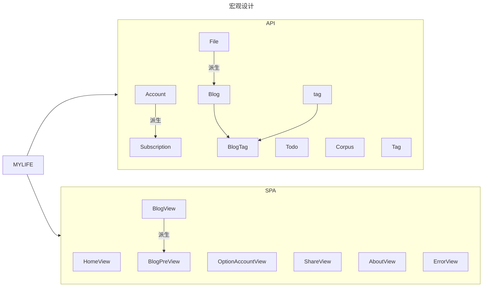
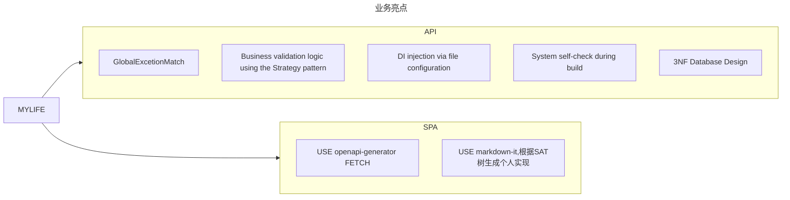

# 项目结构

```mermaid
---
title: 宏观设计
---
graph LR
  MYLIFE --> API & SPA
  subgraph API
    File--派生-->Blog
    Account--派生-->Subscription
    Todo
    Corpus
    Tag
    Blog & tag -->BlogTag
  end

  subgraph SPA
    HomeView
    OptionAccountView
    BlogView--派生-->BlogPreView
    ShareView
    AboutView
    ErrorView
  end
```

```mermaid
---
title: 业务亮点
---
graph LR

MYLIFE --> API & SPA

subgraph API
GlobalExcetionMatch
BVLUTSP["Business validation logic using the Strategy pattern"]
DIVFC["DI injection via file configuration"]
sscdb["System self-check during build"]
dd["3NF Database Design"]
end

subgraph SPA
OC["USE openapi-generator FETCH "]
MI["USE markdown-it,根据SAT树生成个人实现"]
end
```

## 前端待办

- [ ] 完善 OptionAccount (仍在考虑优化)
- [x] 添加 Blog 详情页（即 Markdown 文档渲染器组件）
- [ ] 设计时间线组件

## 后端待办

- [ ] 持续优化业务代码
- [ ] 追加 Blog 业务
- [ ] 追加 业务流程控制
- [ ] 重写所有业务流程,使用统一业务流
