# NET Core 开发要点

## C# 开发要点

### 模式匹配

支持模式匹配的语法或关键字：
is,switch

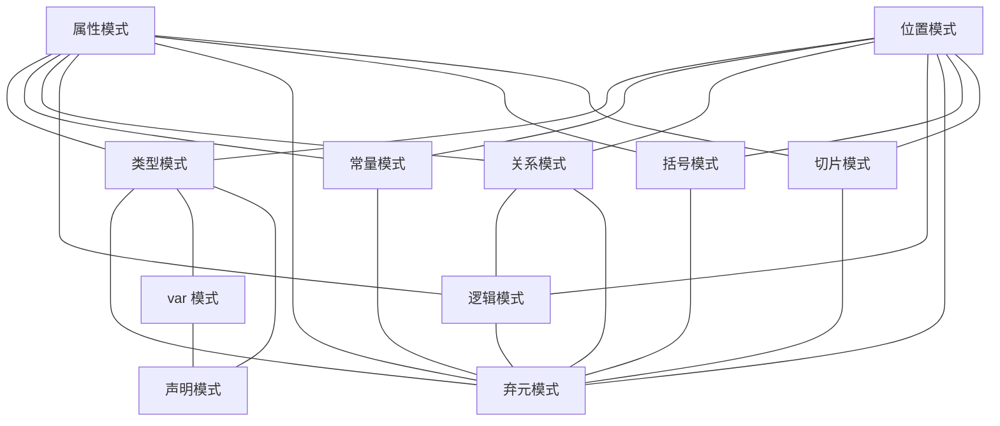

简化来看，所有的模式都需要使用弃元模式.

常规模式： 类型、常量、关系、逻辑模式

符号模式：切片 、弃元、括号、var模式

#### 类型模式

```c#

var x = obj switch{
  string => true,
  object => false,
  double => true
};
```

#### 声明模式

```C#
var x= obj switch{
  int i=>i*i,
  string s =>s+s,
  object o=>o.ToString()
};

```

##### `var`模式

```C#
static bool IsAcceptable(int id, int absLimit) =>
    SimulateDataFetch(id) is var results 
    && results.Min() >= -absLimit 
    && results.Max() <= absLimit;

static int[] SimulateDataFetch(int id)
{
    var rand = new Random();
    return Enumerable
               .Range(start: 0, count: 5)
               .Select(s => rand.Next(minValue: -10, maxValue: 11))
               .ToArray();
}
// switch
public record Point(int X, int Y);

static Point Transform(Point point) => point switch
{
    var (x, y) when x < y => new Point(-x, y),
    var (x, y) when x > y => new Point(x, -y),
    var (x, y) => new Point(x, y),
};

static void TestTransform()
{
    Console.WriteLine(Transform(new Point(1, 2)));  // output: Point { X = -1, Y = 2 }
    Console.WriteLine(Transform(new Point(5, 2)));  // output: Point { X = 5, Y = -2 }
}
```

#### 常量模式

```c#
var x=value switch
{
    1 => 12.0m,
    2 => 20.0m,
    3 => 27.0m,
    4 => 32.0m,
    0 => 0.0m
};
```

#### 关系模式

单纯的大小比较，`switch`内使用`>=,<=,<,>,=`等符号

```c#
var x= a switch{
  <=10  =>"spring",
  <=100 =>"cool",
  int.MaxValue =>"That's very cool",
  _=throw new Exception("Error Value")
}
```

#### 逻辑模式

使用`and,or,not`

```C#
string? str =string.Empty;

if( str is not null )
  Console.WriteLine(str);

int a =12;

var x= a switch{
  <=10 and <=99 =>"spring",
  <=100 and <=999 =>"cool",
  int.MaxValue =>"That's very cool"
}

```

##### 括号优先模式

```c#
if (input is not (float or double))
{
    return;
}
```

#### 属性模式

```c#
// is
static bool IsConferenceDay(DateTime date) => date is { Year: 2020, Month: 5, Day: 19 or 20 or 21 };

// switch

Console.WriteLine(TakeFive("Hello, world!"));  // output: Hello
Console.WriteLine(TakeFive("Hi!"));  // output: Hi!
Console.WriteLine(TakeFive(new[] { '1', '2', '3', '4', '5', '6', '7' }));  // output: 12345
Console.WriteLine(TakeFive(new[] { 'a', 'b', 'c' }));  // output: abc

static string TakeFive(object input) => input switch
{
    string { Length: >= 5 } s => s.Substring(0, 5),
    string s => s,

    ICollection<char> { Count: >= 5 } symbols => new string(symbols.Take(5).ToArray()),
    ICollection<char> symbols => new string(symbols.ToArray()),

    null => throw new ArgumentNullException(nameof(input)),
    _ => throw new ArgumentException("Not supported input type."),
};


```

#### 弃元模式

该模式主要是提供一个能够匹配所有结果 的语法,使用`_`表示

```c#

var x =>obj switch{
  MyObject {min:>=0} e=>e.min,
  _=0
};
```

#### 切片模式

使用`..`标识，可以匹配0-若干个元素。

#### 位置模式

```c#
public readonly struct Point
{
    public int X { get; }
    public int Y { get; }

    public Point(int x, int y) => (X, Y) = (x, y);

    public void Deconstruct(out int x, out int y) => (x, y) = (X, Y);
}

static string Classify(Point point) => point switch
{
    (0, 0) => "Origin",
    (1, 0) => "positive X basis end",
    (0, 1) => "positive Y basis end",
    _ => "Just a point",
};
```

#### 列表模式

```c#
int[] numbers = { 1, 2, 3 };

Console.WriteLine(numbers is [1, 2, 3]);  // True
Console.WriteLine(numbers is [1, 2, 4]);  // False
Console.WriteLine(numbers is [1, 2, 3, 4]);  // False
Console.WriteLine(numbers is [0 or 1, <= 2, >= 3]);  // True
```

### 关键字

#### abstract/interface/virtual

##### abstract

用于修饰非完整定义的关键字；
可用于 类，方法，属性，索引和事件。

当该类修饰类时，该类被称为抽象类；修饰类成员时（属性，方法等），称之为抽象成员。

抽象类特性：

- 抽象类不能被实例化。
- 继承该抽象类的子类，必须实现该抽象类的所有抽象成员；除非子类也是一个抽象类。
- 该修饰类不能和`sealed`关键字合用，因为两个关键字具有相反的含义。(`abstract`修饰类，必须可以被继承；而`sealed`修饰类要求该类不能被继承)
- 抽象类可以包含抽象成员和普通成员。

抽象方法：

- 抽象方法也是一种虚方法（定义时会隐式声明）。
- 该（抽象）方法只能存在于抽象类。
- 抽象方法没有实际实现，不需要方法主体。
- 抽象方法不能和`static`,`virtual`合用。

抽象属性：

- 抽象属性不能和`static`关键字合用，但可以使用`virtual`关键字。
- 抽象属性可以被派生类使用`override`关键字重写

##### interface

在命名空间中声明但未嵌套在另一种类型的接口中,该接口被称为**顶级接口**,可以使用`public`,`internal`关键字,默认为`internal`.

被嵌套与其他接口内的接口被称之为**嵌套接口**，可以使用任何访问修饰符。

接口可以定义默认成员实现，静态成员，普通接口成员。

静态成员包括：

- `static` :普通静态成员
- `static abstract`:静态抽象成员
- `static virtual` :静态虚拟成员，该成员若为方法，则在派生类实现时必须具有重载运算符`operator`。

普通接口成员包括 属性、索引器、方法、事件。

默认接口成员包括 常量、运算符、静态构造函数、嵌套类型、静态成员、显式实现成员，`修饰符？`.

> 添加默认接口成员会强制实现接口的任何 `ref struct` 添加该成员的显式声明。

##### virtual

`virtual` 关键字用于修改方法、属性、索引器或事件声明，并使它们可以在派生类中被重写。
`virtual` 修饰符不能与 `static`、`abstract`、`private` 或 `override` 修饰符一起使用。

被该关键字修饰的成员，在派生类中可以创建基类自己的实现（使用`override`），这种实现具有和基类实现一致的参数结构、返回类型以及成员访问性；如果不一致则必须使用`new`关键字，强制覆盖基类实现。

##### `interface`、`abstract`和`virtual` 三关键字异同

相同点：

- `interface` 和`abstract`都是强调派生类继承的关键字，实现该关键字的派生类都需要**实现定义的所有成员**[^1] 。并且**不能实例化**

异同点：

- `interface`用于**定义接口**
- `abstract`**可以定义抽象类或抽象成员**[^1]
- `virtual`**仅可以定义类成员**[^1]

对于接口和抽象类来说，当IB继承自IA时，IB会隐式继承IA的所有成员，并且IB的派生类在实现IB后还必须实现IA的所有成员。

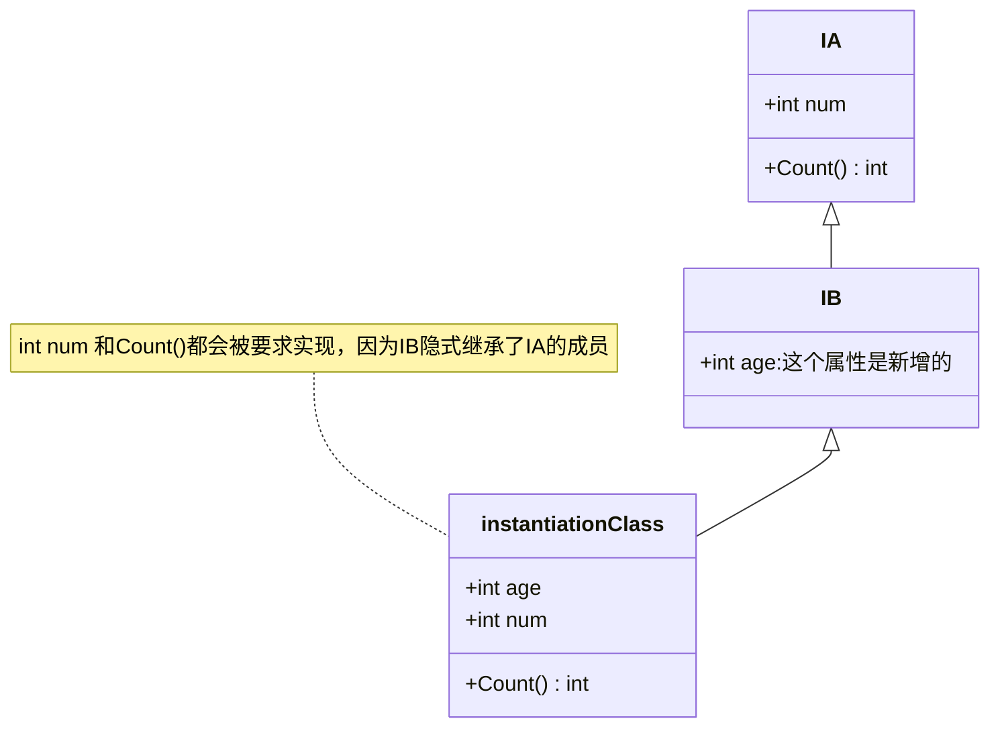

###### 抽象类

- `abstract`用于定义抽象类，抽象类的的抽象属性，方法必须被子类全部实现。
  - 如果存在`virtual`属性，或方法，子类可以不实现，但会默认继承。
  - 如果抽象类内部没有任何抽象属性或方法，那么子类会默认继承抽象类的所有默认实现。
  - 给成员[^1]使用时，其效果等同于接口内的成员[^1]定义，需要实现。
  - 抽象成员只能定于在抽象类内

###### 接口

- `interface`
  - 如果接口继承自了另一个接口，那么派生接口就隐式拥有了基接口的所有成员；如果这个派生接口由一个派生类，那么这个类需要实现这个派生接口的所有成员(包含基接口的成员)

###### 虚成员

- `virtual`,使用该关键字的成员[^1],派生类可以选择实现;如果不重写，则继承默认实现。
  - 即使重写了实现，也可以通过base关键字访问基类实现。

[^1]: 属性，方法

---

---

#### override/new

##### override

扩展或修改继承的方法、属性、索引器或事件的抽象或虚拟实现需要 `override` 修饰符。

`override` 方法提供从基类继承的方法的新实现。
通过 `override` 声明重写的方法称为重写基方法;`override` 方法必须具有与重写基方法相同的签名;
`override` 方法支持协变返回类型;具体而言，`override` 方法的返回类型可从相应基方法的返回类型派生。

不能重写非虚方法或静态方法;重写基方法必须是 `virtual`、`abstract` 或 `override`。

`override` 声明不能更改 `virtual` 方法的可访问性。 `override` 方法和 `virtual` 方法必须具有相同级别访问修饰符。

不能使用 `new`、`static` 或 `virtual` 修饰符修改 `override` 方法。

重写属性声明必须指定与继承的属性完全相同的访问修饰符、类型和名称。 重写只读属性支持协变返回类型。 重写属性必须为 `virtual`、`abstract` 或 `override。`

```c#
//协变类型 : 即该类型派生自原成员（返回）类型的类型。C# 9.0支持

public class Query { }

public class IncludeQuery : Query { }

public class EntityAction
{
    public virtual Query? list => new();
    public virtual Query? Search() => new Query();
}

public class IncludeEntityAction : EntityAction
{
    public override IncludeQuery? list => new();
    public override IncludeQuery? Search() => new IncludeQuery();
}
```

##### new

在用作声明修饰符时，`new` 关键字可以显式隐藏从基类继承的成员; 隐藏继承的成员时，该成员的派生版本将替换基类版本。

使用该关键字重写的基类实现，可以拥有和基类实现不一样的类型和参数结构等。

#### as/is

##### as

该关键字用于类型转换，当转换失败时，返回null。

语法如下：

```csharp
obj as string
//如果obj 不能转换为string,则返回null;反之则为obj的string值.
```

##### is

该关键字用于检查运算符检查表达式的结果是否与给定的类型相匹配。

语法如下：

```c#
int a =10;
a is string // false

// 声明模式
string? str = "Hello";
str is string s //true
Console.WriteLine(s);//Hello

// 列表模式（支持列表List或者数组Array）
int[] empty = [];
int[] one = [1];
int[] odd = [1, 3, 5];
int[] even = [2, 4, 6];
int[] fib = [1, 1, 2, 3, 5];

Console.WriteLine(odd is [1, _, 2, ..]);   // false
Console.WriteLine(fib is [1, _, 2, ..]);   // true
Console.WriteLine(fib is [_, 1, 2, 3, ..]);     // true
Console.WriteLine(fib is [.., 1, 2, 3, _ ]);     // true
Console.WriteLine(even is [2, _, 6]);     // true
Console.WriteLine(even is [2, .., 6]);    // true
Console.WriteLine(odd is [.., 3, 5]); // true
Console.WriteLine(even is [.., 3, 5]); // false
Console.WriteLine(fib is [.., 3, 5]); // true
```

> 支持模式匹配

#### async/await

##### async

异步方法关键字，可修饰 方法，拉姆表达式，匿名方法。
使用该关键字返回的值类型都是`Task`,`Task<TResult>`,且该方法的调用必须使用await关键字，否则将以同步方式运行。

```c#
public async Task MyMethod(){/*code*/}

await MyMethod();
```

##### await

运算符暂停对其所属的 async 方法的求值，直到其操作数表示的异步操作完成。

异步流
可用于`foreach`,`using`语句

#### base/this

##### base

该关键字用于从派生类中访问基类的成员。

- 仅允许基类访问在构造函数、实例方法和实例属性访问器中进行。
- 在静态方法中使用 base 关键字将产生错误。
- 基类指向声明时的类，而非继承链上的基类。

```c#
public class a:Person{}//对于a而言，他的基类就是person

public class b:a{} //对于而言，他的基类就是a
```

##### this

this 关键字指代类的当前实例，还可用作扩展方法的第一个参数的修饰符.

```c#
//限定类似名称隐藏的成员
public class Employee
{
    private string alias;
    private string name;

    public Employee(string name, string alias)
    {
        // Use this to qualify the members of the class
        // instead of the constructor parameters.
        this.name = name;
        this.alias = alias;
    }
}

//将对象作为参数传递给方法
CalcTax(this);

//声明索引器
public int this[int param]
{
    get { return array[param]; }
    set { array[param] = value; }
}

//作为隐式参数
public static class s{
  public static void Read(this string str){
    Console.WriteLine(str);
  }
}

string s = "Hello";
s.Read();//Hello
```

#### params/in/out/ref

##### out

具有两种用途：

- 作为参数修饰符 ，传递值时，参数将不再是接收值，而是接收对传递参数的（写）引用，在方法内发生改变时，改变也会传递至参数源。
- 用于接口和委托的泛型参数声明，表明该参数为**协变类型**。

禁用场景：

- 异步方法
- 迭代器方法
- 属性

##### in

用途：

- 作为方法参数修饰符，传递对该自参数的只读引用.
- 作为（接口和委托）泛型参数声明，表面该参数可为**逆变类型**
- 作为`foreach`语法的一部分
- 作为`linq`子句`from`的一部分
- 作为`linq`子句`join`的一部分

##### params

作为参数修饰符，被修饰的参数只能作为参数列表的最后一个参数，且参数列表只能有一个。

该修饰符参数可以接收0到任意数量的参数。
被修饰参数只能是集合类型：

- T[]
- 范围类型
  - `System.Span<T>`
  - `System.ReadOnlySpan<T>`
- 具有可访问创建方法及相应元素类型的类型。 创建方法使用用于集合表达式的相同属性进行标识。
  实现`System.Collections.Generic.IEnumerable<T>` 的结构或类类型，其中:
  - 类型具有一个构造函数，可以在没有参数的情况下调用，并且该构造函数至少与声明成员一样可访问。
  - 类型具有实例（而不是扩展）方法 Add，其中：
    - 可以使用单个值参数调用该方法。
    - 如果方法是泛型方法，则可以从参数推断类型参数。
    - 该方法至少与声明成员一样可访问。(此处，元素类型是类型的迭代类型。)
- 接口类型：
  - `System.Collections.Generic.IEnumerable<T>`
  - `System.Collections.Generic.IReadOnlyCollection<T>`
  - `System.Collections.Generic.IReadOnlyList<T>`
  - `System.Collections.Generic.ICollection<T>`
  - `System.Collections.Generic.IList<T>`

##### ref

用途：

- 引用返回 `ref return`
- 引用参数 (可与`readonly`合用，限制参数引用只读，相当于`in`)
- 定义引用变量
- 变量引用赋值
- 引用结构
- 结构引用字段
  - `readonly ref` : 引用只读，在初始化或构造函数种可以修改对字段的引用，任何时间都可以修改对应引用的值。
  - `ref readonly` : 值只读，在任何时候都不能修改引用的值，其他时候可以修改引用。
  - `readonly ref readonly`:完全只读，仅可以在初始化或构造函数中修改引用，其他时候无法修改任何值或引用。

可以用于修饰变量和参数，使用其拥有对**基础类型**的值引用。

#### 访问性关键字

public,private,internal,protected
组合：

- private internal
- protecteed internal

|类型|默认成员访问性|支持访问性|
|--|--|--|
|`enum`|`public`|无|
|`class`|`private`|全部|
|`interface`|`public`|全部|
|`struct`|`private`|`public`,`private`,`internal`|

`readonly` （引用类型）属性只读
`const` （值类型）创建常量
`extern` 声明由外部程序集实现的方法
`sealed` 禁止继承

> 特例：interface 的私有成员必须具有默认实现;

#### 类型关键字

此处仅展示作为关键字的类型

值类型：

sbyte,byte,short,int,long,nint
ushort,uint,ulong,nuint //无符号
float,double,**decimal** //浮点数值
bool
char
enum
struct
ref struct

引用类型：
string,object,delegate,class,interface,record

特别类型：void

#### 语句关键字

赋值用`var`

条件 `if`,`else`,`switch`,`case`,`break`,`default`,`where`,`when`

迭代 `for`,`foreach`,`do`,`while`,`continue`,`return`,`goto`,`yield`

异常 `throw`,`try`,`catch`,`finaly`

算术检查 `checked`,`unchecked`

指针操作 `fixed`，`unsafe`

线程锁 `lock`,`volatile`

引入 `using`,`namespace`

#### 上下文关键字

事件 `event`,`add`,`remove`
属性 `set`,`get`,`init`
拆分 `partial`
非空 `required`
当前值 `value`

#### 值关键字

默认值 `default`
布尔值 `true`,`false`
空值 `null`

### LINQ

### 设计模式

#### 工厂模式 [创建型模式]

##### 简单工厂

```c#
public interface IPhone {
    void getBrand();
}

public class Meizu : IPhone {
    
    public void getBrand() {
        Console.WriteLine("这是一台魅族手机。");
    }
}

public static class PhoneFactory {
    public IPhone? createPhone(String brand) {
        if ("Meizu".equals(brand)) {
            return new Meizu();
        } else {
            Console.WriteLine("抱歉，暂不支持该品牌手机。");
            return null;
        }
    }
}

```

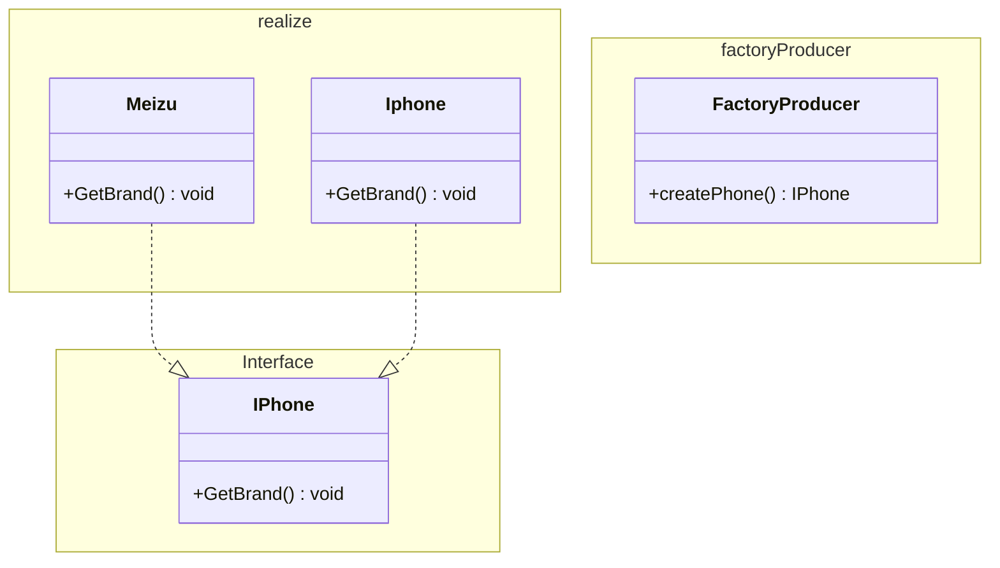

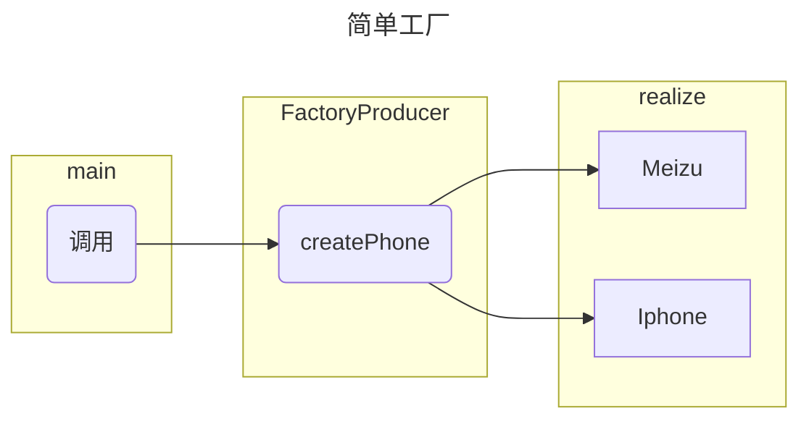

##### 工厂方法

```c#
//在简单方法的基础上增加
public class Xiaomi : IPhone {
    public void getBrand() {
        System.out.println("小米");
    }
}

public interface PhoneFactory{
  IPhone CreatePhone();
} 

public class MeizuFactory :PhoneFactory{
  Meizu CreatePhone()=>new();
}

public class XioamiFactory :PhoneFactory{
  Xiaomi CreatePhone()=>new();
}

public class IphoneFactory :PhoneFactory{
  Iphone CreatePhone()=>new();
}

```

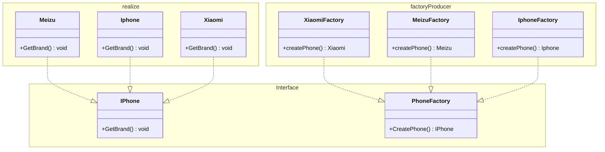

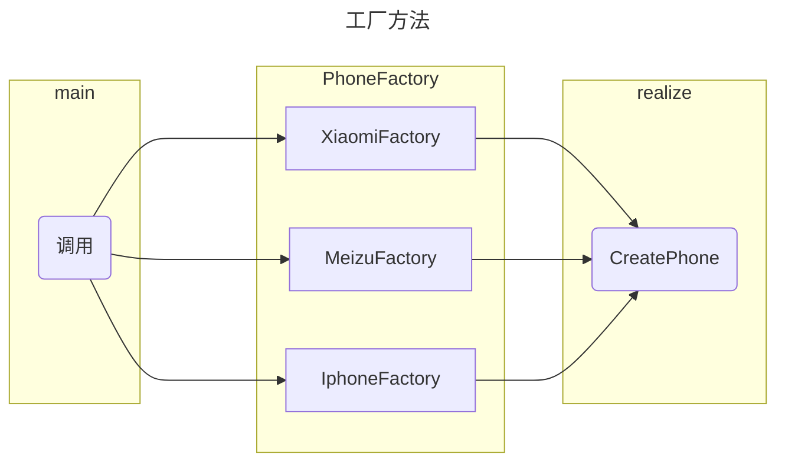

##### 抽象工厂

```c#
// 定义 Shape 接口
public interface Shape
{
    void Draw();
}

// 定义具体形状类
public class Rectangle : Shape
{
    public void Draw()
    {
        Console.WriteLine("Inside Rectangle::Draw() method.");
    }
}

// 定义 Color 接口
public interface Color
{
    void Fill();
}

// 定义具体颜色类
public class Red : Color
{
    public void Fill()
    {
        Console.WriteLine("Inside Red::Fill() method.");
    }
}

// 创建抽象工厂类
public abstract class AbstractFactory
{
    public abstract Shape GetShape(string shapeType);
    public abstract Color GetColor(string colorType);
}

// 创建具体工厂类 ShapeFactory
public class ShapeFactory : AbstractFactory
{
    public override Shape GetShape(string shapeType)
    {
        if (shapeType == "Rectangle")
            return new Rectangle();
        // 其他形状的逻辑...
        return null;
    }

    public override Color GetColor(string colorType)
    {
        return null; // ShapeFactory 不负责颜色
    }
}

// 创建具体工厂类 ColorFactory
public class ColorFactory : AbstractFactory
{
    public override Shape GetShape(string shapeType)
    {
        return null; // ColorFactory 不负责形状
    }

    public override Color GetColor(string colorType)
    {
        if (colorType == "Red")
            return new Red();
        // 其他颜色的逻辑...
        return null;
    }
}

// 使用 FactoryProducer 获取 AbstractFactory 对象
var shapeFactory = FactoryProducer.GetFactory("Shape");
var rectangle = shapeFactory.GetShape("Rectangle");
rectangle.Draw(); // 输出：Inside Rectangle::Draw() method.

var colorFactory = FactoryProducer.GetFactory("Color");
var red = colorFactory.GetColor("Red");
red.Fill(); // 输出：Inside Red::Fill() method.
```

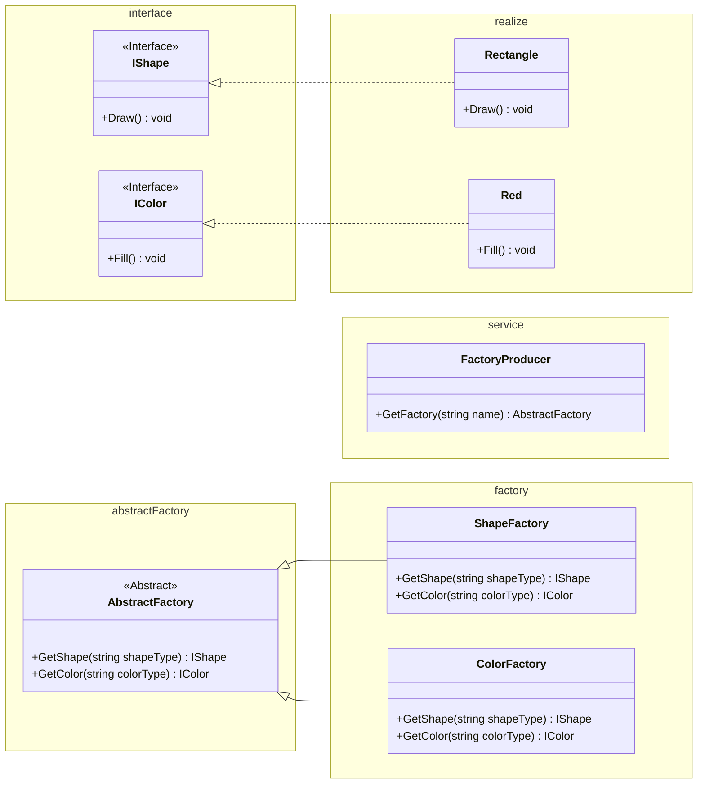

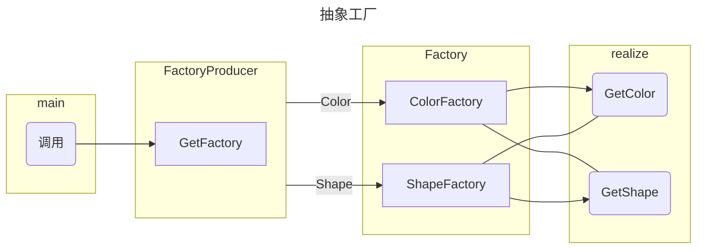

抽象方法通过FactoryProducer作为工厂构造器，通过getFactory()方法返回相应的工厂。

---

#### 原型模式 [创建型模式]

```c#
// 通用形状接口
public abstract class Shape {
    public int x;
    public int y;
    public String color;

    public Shape() { }

    public Shape(Shape target) {
        if (target != null) {
            this.x = target.x;
            this.y = target.y;
            this.color = target.color;
        }
    }

    public abstract Shape clone();

    public virtual boolean equals(Object object2) {
        if (!(object2 instanceof Shape))
            return false;
        Shape shape2 = (Shape) object2;
        return shape2.x == x && shape2.y == y && Objects.equals(shape2.color, color);
    }
}

// 简单形状：圆
public class Circle : Shape {
    public int radius;

    public Circle() { }

    public Circle(Circle target) {
        super(target);
        if (target != null) {
            this.radius = target.radius;
        }
    }

    
    public Shape clone() {
        return new Circle(this);
    }
}

// 另一个形状：矩形
public class Rectangle : Shape {
    public int width;
    public int height;

    public Rectangle() { }

    public Rectangle(Rectangle target) {
        super(target);
        if (target != null) {
            this.width = target.width;
            this.height = target.height;
        }
    }

    
    public Shape clone() {
        return new Rectangle(this);
    }
}

// 克隆示例
public class Demo {
    public static void main(String[] args) {
        List<Shape> shapes = new ArrayList<>();
        List<Shape> shapesCopy = new ArrayList<>();

        Circle circle = new Circle();
        circle.x = 10;
        circle.y = 20;
        circle.radius = 15;
        circle.color = "red";
        shapes.add(circle);

        Circle anotherCircle = (Circle) circle.clone();
        shapes.add(anotherCircle);

        Rectangle rectangle = new Rectangle();
        rectangle.width = 10;
        rectangle.height = 20;
        rectangle.color = "blue";
        shapes.add(rectangle);

        cloneAndCompare(shapes, shapesCopy);
    }

    private static void cloneAndCompare(List<Shape> shapes, List<Shape> shapesCopy) {
        for (Shape shape : shapes) {
            shapesCopy.add(shape.clone());
        }

        for (int i = 0; i < shapes.size(); i++) {
            if (shapes.get(i) != shapesCopy.get(i)) {
                Console.WriteLine(i + ": Shapes are different objects");
                if (shapes.get(i).equals(shapesCopy.get(i))) {
                    Console.WriteLine(i + ": And they are identical");
                } else {
                    Console.WriteLine(i + ": But they are not identical");
                }
            } else {
                Console.WriteLine(i + ": Shape objects are the same");
            }
        }
    }
}
```

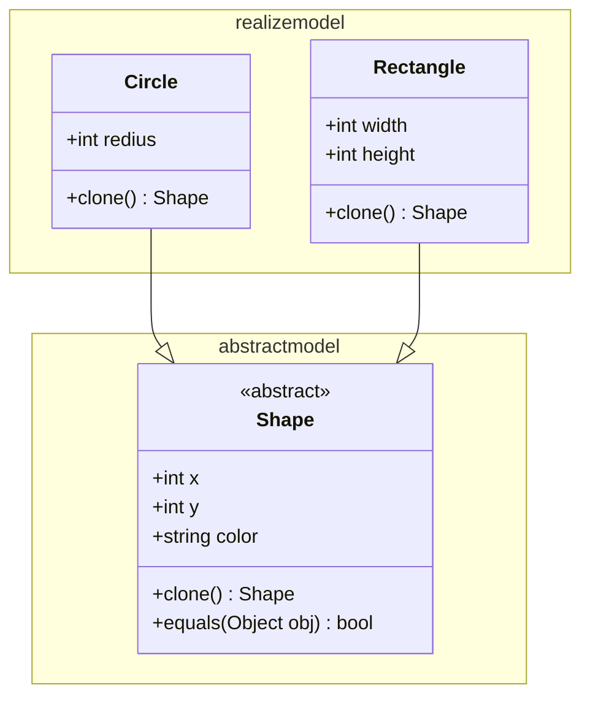

这个模式比较低级，主要通过自定义clone方法来实现复制;然后通过各种类型嵌套组合在实现对应复制；

#### 单例模式 [创建型模式]

主要是一个自包含结构的类，其本身的初始化由自己负责，外部无法构造。

特点=>私有的构造函数

```c#
public class Singleton {
    private static Singleton instance;

    private Singleton() { }

    public static Singleton getInstance() {
        if (instance == null) {
            instance = new Singleton();
        }
        return instance;
    }

    public void showMessage() {
        Console.WriteLine("Hello from Singleton!");
    }
}

public class SingletonDemo {
    public static void main(String[] args) {
        Singleton singleton = Singleton.getInstance();
        singleton.showMessage(); // 输出：Hello from Singleton!
    }
}
```

#### 建造者模式[创建型模式]

特点：

- 建造者：创建并提供实例。
- 导演：管理建造出来的实例的依赖关系和控制构建过程。

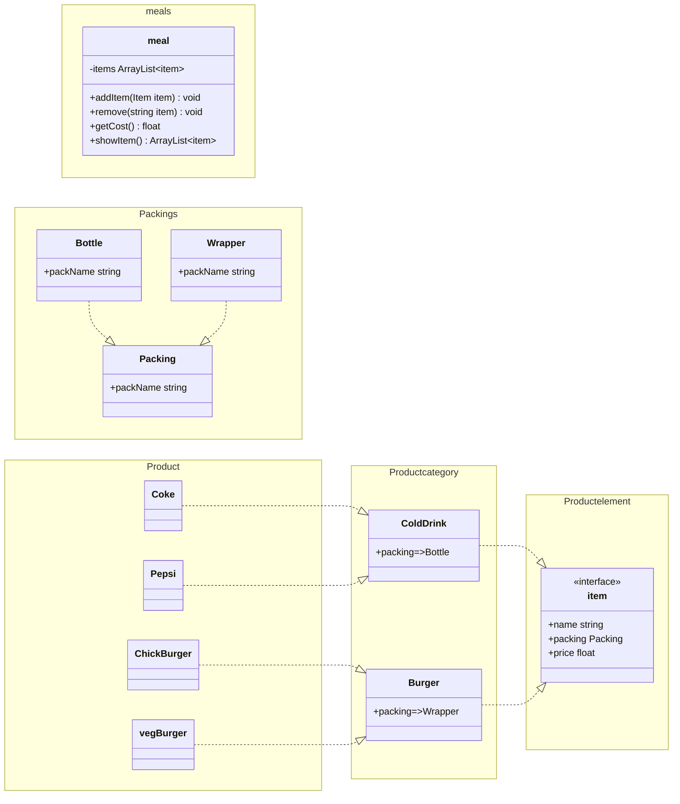

#### 装饰模式[结构型模式]

装饰模式是一种设计模式，它允许你在不修改原有的类的情况下给一个对象添加新的功能。在装饰模式中，装饰类包装原始类并提供相同的接口，装饰类可以添加新的行为。

- 抽象组件（Component）：定义了原始对象和装饰器对象的公共接口或抽象类，可以是具体组件类的父类或接口。
- 具体组件（Concrete Component）：是被装饰的原始对象，它定义了需要添加新功能的对象。
- 抽象装饰器（Decorator）：继承自抽象组件，它包含了一个抽象组件对象，并定义了与抽象组件相同的接口，同时可以通过组合方式持有其他装饰器对象。
- 具体装饰器（Concrete Decorator）：实现了抽象装饰器的接口，负责向抽象组件添加新的功能。具体装饰器通常会在调用原始对象的方法之前或之后执行自己的操作。

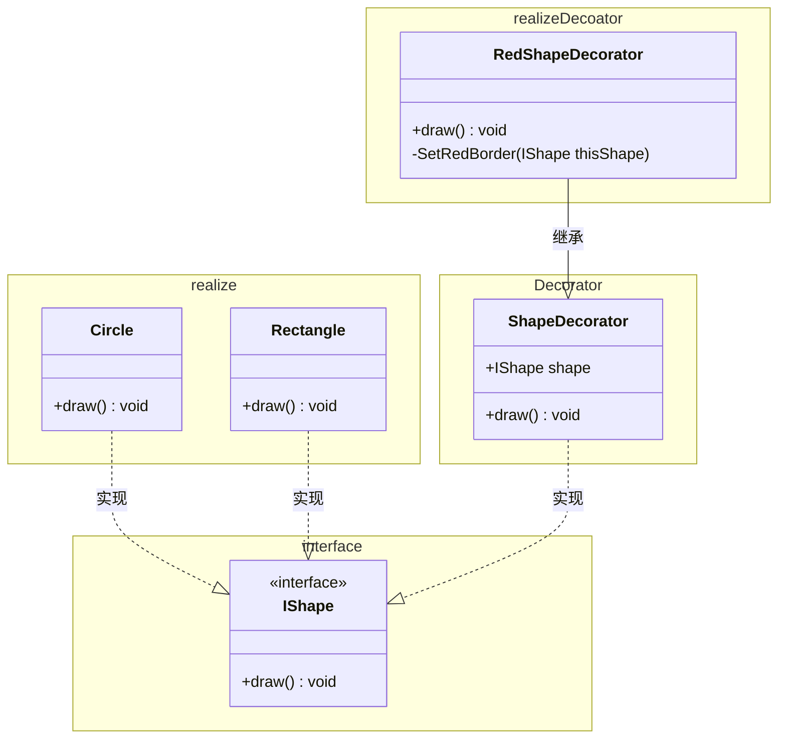

#### 外观模式[结构型模式]

为一个复杂的子系统提供一个一致的高层接口。这样，客户端代码就可以通过这个简化的接口与子系统交互，而不需要了解子系统内部的复杂性。

- 外观（Facade）:
  - 提供一个简化的接口，封装了系统的复杂性。外观模式的客户端通过与外观对象交互，而无需直接与系统的各个组件打交道。
- 子系统（Subsystem）:
  - 由多个相互关联的类组成，负责系统的具体功能。外观对象通过调用这些子系统来完成客户端的请求。
- 客户端（Client）:
  - 使用外观对象来与系统交互，而不需要了解系统内部的具体实现。

> 由于外观模式接近抽象工厂模式，只需要注意外观模式是对一些对象的集中管理器？
>
> 抽象工厂是允许单次获得一个对象，主要是创建；
>
> 而外观模式内会存在多个对象，并对这些对象的方法进行二次使用封装，产生新的目的方法。

#### 适配器模式[结构型模式]

它允许不兼容的接口之间进行交互。这是通过包装它自己所包含的对象来改变它们的接口而实现的。适配器模式主要分为两种类型：类适配器和对象适配器。

- 目标接口（Target）：定义客户需要的接口。
- 适配者类（Adaptee）：定义一个已经存在的接口，这个接口需要适配。
- 适配器类（Adapter）：实现目标接口，并通过组合或继承的方式调用适配者类中的方法，从而实现目标接口。

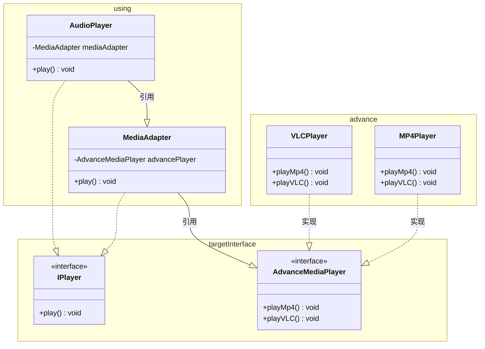

#### 组合模式[结构型模式]

类内部增加集合属性，在使用时，可以实时添加类实例给特定类实例，形成实例嵌套，从而在数据层面上形成层级关系；适用于具有层级关系的类，例如分类，员工部门等逻辑上的上下级结构，这种数据结构利于客户端接收，但过深的嵌套结构不利于查询和修改。

组合模式的核心角色包括：

- 组件（Component）:
  - 定义了组合中所有对象的通用接口，可以是抽象类或接口。它声明了用于访问和管理子组件的方法，包括添加、删除、获取子组件等。
- 叶子节点（Leaf）:
  - 表示组合中的叶子节点对象，叶子节点没有子节点。它实现了组件接口的方法，但通常不包含子组件。
- 复合节点（Composite）:
  - 表示组合中的复合对象，复合节点可以包含子节点，可以是叶子节点，也可以是其他复合节点。它实现了组件接口的方法，包括管理子组件的方法。
- 客户端（Client）:
  - 通过组件接口与组合结构进行交互，客户端不需要区分叶子节点和复合节点，可以一致地对待整体和部分。

```c#
import java.util.ArrayList;
import java.util.List;
 
public class Employee {
   private String name;
   private String dept;
   private int salary;
   private List<Employee> subordinates;//关键属性，一个可以扩展的集合属性
 
   //构造函数
   public Employee(String name,String dept, int sal) {
      this.name = name;
      this.dept = dept;
      this.salary = sal;
      subordinates = new ArrayList<Employee>();
   }
 
  #region  组件
   public void add(Employee e) {
      subordinates.add(e);
   }
 
   public void remove(Employee e) {
      subordinates.remove(e);
   }
 
   public List<Employee> getSubordinates(){
     return subordinates;
   }
 
   public String toString(){
      return ("Employee :[ Name : "+ name 
      +", dept : "+ dept + ", salary :"
      + salary+" ]");
   }   
   #endregion
}


// 使用时

var obj =newEmployee();
Employee newEmployee = new();
obj.add(newEmployee);

// obj:
//    newEmployee
```

#### 桥接模式[结构型模式]

类似于抽象工厂，但是没有通用工厂类，只在抽象类里定义所需组件，然后在派生类中调用该组件，对组件的实现不关心；在实际调用时，需要手动引入自己所需的组件才能完成工作流。


#### 享元模式[结构型模式]

#### 代理模式[结构型模式]

## 生命周期

在.NET Core或.NET 5+（包括.NET 8）中，`services.AddScoped()`方法用于注册服务的生命周期是“Scoped”，这意味着每个请求（或者说每个作用域）都会创建一个新的服务实例。这与全局单例（Singleton）和每个请求单例（Transient）的生命周期不同。

- **Singleton**：服务的单个实例在应用程序的生命周期内被创建，并且在整个应用程序中被重用。这意味着，无论你在哪里请求这个服务，都会得到同一个实例。

- **Scoped**：服务的实例在每个请求（或作用域）中被创建，并且在该请求的生命周期内被重用。这意味着，如果你在同一个请求中多次请求这个服务，你将得到同一个实例。但是，如果你在不同的请求中请求这个服务，你将得到不同的实例。

- **Transient**：服务的新实例在每次请求时被创建。这意味着，无论你在哪里或何时请求这个服务，你都将得到一个新的实例。

因此，`services.AddScoped()`方法注册的服务是每个请求都是单例的，而不是全局单例。这种生命周期适合于那些需要在请求范围内保持状态的服务，例如数据库上下文（DbContext）。

如果你想要注册一个全局单例服务，你应该使用`services.AddSingleton()`方法。如果你想要每次请求都创建一个新的服务实例，你应该使用`services.AddTransient()`方法。

总结一下，`services.AddScoped()`方法注册的服务是每个请求都是单例的，这意味着在同一个请求中多次请求这个服务时，你将得到同一个实例。

## NET 数据迁移

数据迁移用于将项目内Model转换为对应的数据库表，可以用于快速创建符合项目需求的数据库。

> 目前适用于关系型数据库

### 前置条件

项目要求

- 关系型数据库

- 数据库连接字符串
  - 有一个独立的数据库，不要使用系统数据库

- `NUGET`包

  - `Microsoft.EntityFrameworkCore.Design`

  - `Mysql.Data`

  - `MySql.EntityFrameworkCore`

  - `Pomelo.EntityFrameworkCore.MySql`

### 迁移命令

1. 添加迁移工具
   - `dotnet tool install --global dotnet-ef`

2. 创建迁移命令
   - `dotnet ef migrations add InitialCreate`
   - `InitialCreate`是文件名称，如果已经存在于`migrations`文件夹内，则会创建失败，需要手动删除或使用其他名称。
   - 完整名称通常为`20240326123456_InitialCreate.cs`,即“时间_文件名”。
   - 使用该命令需要检查项目是否存在语法错误，可使用`dotnet build`命令检查，存在则无法运行。
3. 构造SQL
   - `dotnet ef migrations script`
   - 该命令用于生成对应数据库的SQL关系，在这一步可以确认是否符合预期SQL关系。
   - 如果项目配置的数据库连接字符串有问题，则会运行失败。
4. 执行SQL构造
   - `dotnet ef database update`
   - 该命令会在数据库内创建对应的数据表，不含数据库，**需要提前创建好数据库**。
   - 如果对应的数据表已经存在，则会报错，并停止后续执行。

> 温馨提示：如有使用`git` ，请移除对上述命令对自动创建文件的追踪。这是不必要的内容。

---

## 其他

### RSA 密钥创建

前置条件

- `Open ssl`

当然，以下是我们讨论过的所有步骤和命令，整合到一个Markdown文本中，方便你保存：

生成RSA公私钥和CSR文件

首先，我们使用OpenSSL生成一个基于RSA的公私钥对，并创建一个证书签名请求（CSR）文件。

### 生成私钥

```shell
openssl genrsa -aes256 -passout pass:UHJvamVjdFRT -out server_private.key 2048
```

### 生成CSR文件

```shell
openssl req -new -key server_private.key -out server_cert.csr
```

### 生成公钥

```shell
openssl rsa -in server_private.key -pubout -out server_public.key
```

### 创建自签名证书

接下来，我们使用CSR文件生成一个自签名证书。

```shell
openssl x509 -req -days 365 -in server_cert.csr -signkey server_private.key -out server_cert.crt
```

### 创建PFX文件

最后，我们将私钥、公钥和自签名证书打包成一个PFX文件。

```shell
openssl pkcs12 -export -out server.pfx -inkey server_private.key -in server_cert.crt
```

在创建PFX文件时，系统会提示你输入一个密码，这个密码将用于保护PFX文件。请确保记住这个密码，因为在使用PFX文件时可能需要它。
