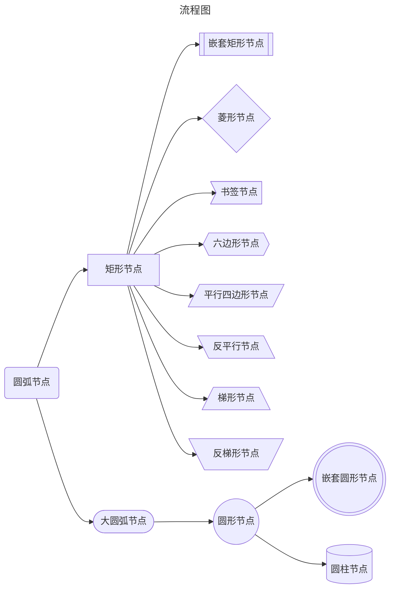
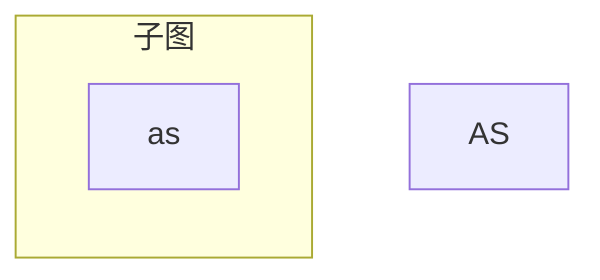
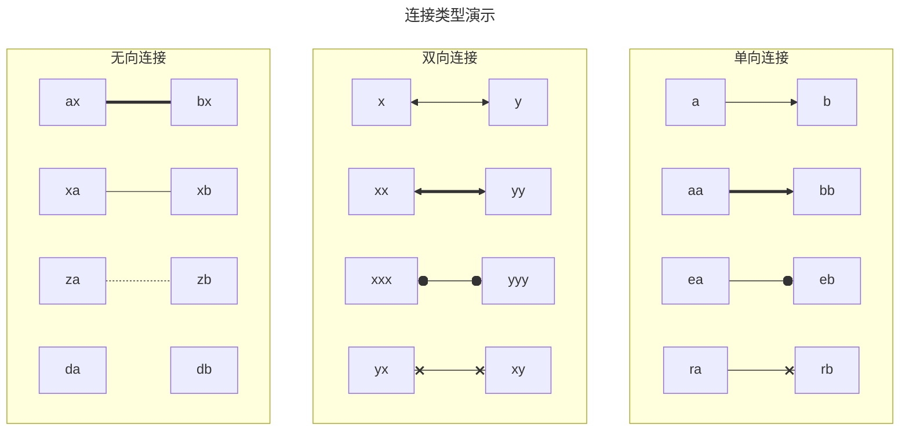
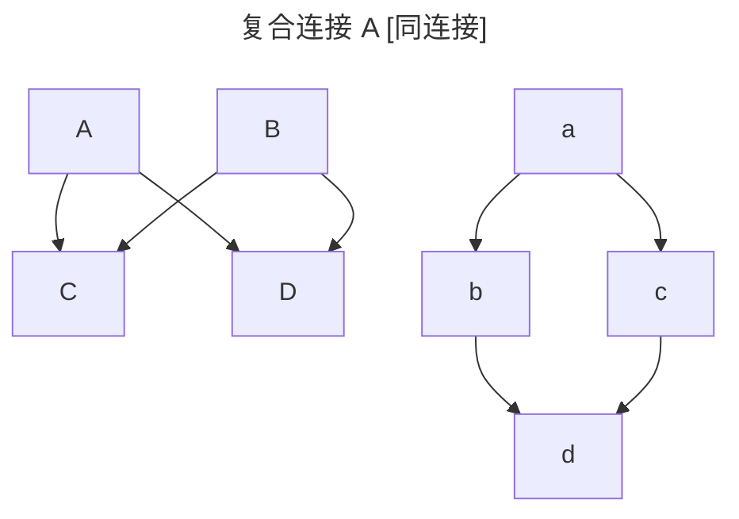

# Mermaid 支持的语法

## 流程图



> 使用关键字 `flowchart`或`graph`定义
>
> unicode 文本在使用时需要"unicode 文本"
>
> - 细线连接 `-->`,只有单一方向
>
> - 粗线连接 `==>` 在细线上使用`=`替换
>
> - 无向连接 `---`
>
> - 虚线连接 `-.-`
>
> - 隐式连接 `~~~`
>
> - 圆头连接 `--o` (使用字母`o`)
>
> - 叉头连接 `--x` (使用字母`x`)
>
> 使用以上连接时，要添加文本则需要将`--`部分扩充为`----`第二个`-`就可以插入文本。
>
> 如果要指定连接的长度，最短为`---`，长度可以随着`-`的增加而增加，这样可以更方便创建图示。

### 子图

```txt
subgraph title
    %% 自定义 %%
end
```



使用子图时，仍然需要避免子图内的名称和外部图示相同

### 连接类型



### 复合连接



> 小a 节点可以同时连接到`b`和`c`

### 其他补充

注释 :使用`%% text %%`标明

互动 ：在`securityLevel='strict'`时被禁用，`securityLevel='loose'`启用

---
