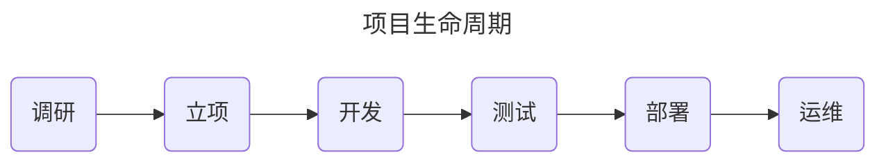
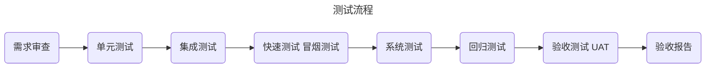
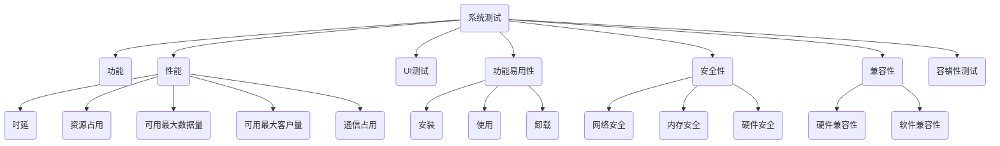
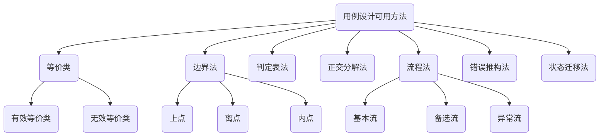
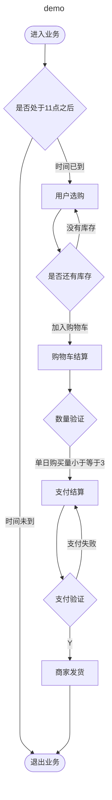

## 测试在项目周期的职能

---

---

- 需求审查 ：
  - 审查需求合理性，定义是否正确，完善[^SRS]
    - 对歧义、错误、不合理、不理解等文档需求与产品进行交流
  
- 单元测试
  - 检查单个(代码)功能组是否正确运行

- 集成测试
  - 多部门联合协调测试

- 冒烟测试
  - 快速测试主要功能，不审查代码
- 系统测试
  - 由下图构成
- 回归测试 
  - 在代码迭代后，对问题进行跟踪测试

- 验收测试 UAT：
  - α 测试 : 本地验收 
  - β 测试 : 客户端部署验收
  - γ 测试 : 最终版本验收
- 验收报告

---

---

[^SRS]: 软件需求说明书

---

黑盒测试 又称之功能测试，重点测试软件的功能

白盒测试 又称之单元测试，多被开发用于内部测试，验证其逻辑和结构是否正常。

静态测试 多被开发用于对项目代码、文本、数据等静态信息的视觉验证测试

动态测试 开发用于测试执行对象是否按照预期使用

---

### 需求评审

- 确保需求文档描述清晰、全面、逻辑合理。
- 确保需求文档易于理解。
- 数据必须具有完整定义、使用场景逻辑描述以及使用场景
  - 数据类型
  - 数据内容量
  - 数据安全范围
  - 使用场景
- 每个需求都应具有完整执行、条件和条件结果。

### 安全性测试

系统安全

- 权限安全
- 组件安全
- 内存安全
- 逻辑安全
- 通信安全
  - 协议安全
  - 信道安全

- 存储安全
  - 文件安全
    - 合法性校验
    - 文件大小校验
    - 文件内容校验
  - 数据库安全

---

## 项目工程模型

- 瀑布模型
  - 对需求反应非常慢
  - 开发周期长
  - 对项目人员要求低，易于合作完成
  - 测试参与周期偏后
- 敏捷模型
  - 使用模糊定义快速开始设计和开发
  - 全部门协同工作，人员要求高，需求团队协作能力
  - 每个迭代周期短，进行快速迭代，迭代变化多
  - 文档产出少，维护困难，容易产出更多隐性问题
  - 测试参与周期早
  - 更易于接受需求变更
- V 模型
- W 模型

---

### 测试原则？

- 测试需关注相关模块，即测试具有上下文相关性
- 不可能穷尽测试
- 测试需要尽早介入（与产品和开发同步）
- 杀虫剂悖论 : 用同样的方式或认知去测试，容易得到同样的结果。
- 缺陷群集性/二八定律 : 产品的20%的模块会产生整个项目80%的缺陷
- 无错误谬论，测试全部通过不意味着这个项目在当前没有问题。xu

### 测试计划

- 项目背景
- 文档目的
  - 受众人群
  - 任务分工
  - 任务时间规划

- 测试环境
  - 硬件
  - 软件
- 测试策略
  - 测试标准
    - 开始测试标准
      - 单元测试（白盒测试）已完成
      - 测试方案和计划已完成，并经过评审
      - 缺陷跟踪和管理系统建设已完成
      - 测试软硬件等测试环境部署完成
    - 测试暂停标准
      - 测试流程中存在大量错误
      - 测试环境出现干扰、感染、破坏
    - 测试恢复标准
      - 冒烟测试已通过
      - 测试环境已恢复
    - 测试质量标准
      - 测试用例100%覆盖执行
      - 系统测试发现的缺陷达到修复标准
      - ...
  - 测试人员和任务的分配
  - 梳理完善需求
- 测试用例
  - 必须覆盖所有功能点

---

[^人时]: 单小时所需人力；

> 8人时 -> 一人需要一天 | 2人需要半天，以此倍减

---

## 测试用例设计和定义要点

- 测试编号
- 测试模块
- 测试功能项描述
- 测试时间
- 测试(前置)条件
- **测试步骤**
- 输入数据
- 用例类型
- 预期结果
- 实际结果

> 测试用例设计的分类和定义：**单元测试用例**、**集成测试用例**、**功能测试用例**、**性能测试用例**、**安全测试用例**、**兼容测试用例**
>
> 测试用例设计需要确保 ： **目标明确**、**覆盖率**、**安全性**、**独立性**、**可重复性**、**易于理解**
>
> 测试用例设计可用方法：**等价类划分法**、**边界值分析法**、**判定表法**、**状态转换法**、**错误推测法**

---

### 等价类

- 弱一般等价类
  - 只包含有效等价类（使用最少测试用例覆盖每个有效等价类）
- 弱健将等价类
  - 包含有效等价类和无效值（弱一般等价类的基础上,增加取值为无效值的情况）
- 强一般等价类
  - 强一般等价类是基于多缺陷假设,强一般等价类的测试用例是要覆盖每个有效等价类 取值的笛卡儿积,即在有效等价类取值的所有组合。
    - 若有效等价类只有三种类型，弱一般等价类设计用例有三种，则强一般等价类应有3*3=9种用例
- 强健壮等价类
  - 在强一般等价类的基础上增加无效等价类的情况。

>测试用例

> 有效等价类应该使用最少组合的测试用例

> 无效等价类不应使用组合测试用例数据

---

### 边界法

取值通常使用等价类的边界值；

- 若有效等价类范围为[0,99],则取0±1和99±1作为测试数据（适用于数值）。
- 若有效等价类范围是一个长度[0,20],则取长度0、1、20±1为测试数据（适用于字符串长度）

上点： 边界值

离点：边界值±1，若小于范围，则-1；反之+1

内点：常取中间值，也可以是区间范围内的任意值·。

---

### 判定表法

判定表多用于具有条件分支的测试

如果一个功能点具有多种状态，就可用使用表格形式列出所有的状态组合

---

### 流程测试

---

按照标准用例格式，写出下面需求的测试用例（用例要包含id，标题，步骤，预期结果等内容）。

 需求: 

1. 用户插入银行卡 系统判断银行卡是否合法。 
   - 如果卡片非法，系统提示"卡片非法"，退卡，流程结束
   - 如果卡片合法则系统提示"请输入密码"
2. 用户输入密码 系统判断密码是否正确
   - 如果密码错误，系统判断密码错误次数是否达到3次
   -  如果已达到3次则机器吞卡，流程结束；
   - 如果未达到3次，系统提示"密码错误，请重新输入" 
   - 如果密码正确则系统提示"请输入取款金额" 
3. 用户输入取款金额 系统判断取款金额是否正确
   - 如果取款金额不是100的整数倍，提示"取款金额必须为100的整数倍，请重新输入" 
   - 如果取款金额>3000元，系统提示"单笔取款不能超过3000元，请重新输入" 
   - 如果累计取款金额>20000元，系统提示"单日取款累计不能超过20000元，请重新输入" 
   - 如果取款金额>账户余额，系统提示"账户余额不足，请重新输入" 
   - 如果取款金额>ATM余额，系统提示"ATM余额不足，请重新输入" 
4. 用户确认取款金额 ATM出钞，流程结束

- 100%?==0

- a < 3000

- 单日取款不能超过2w
- a < 余额 & a < ATM 余额 
