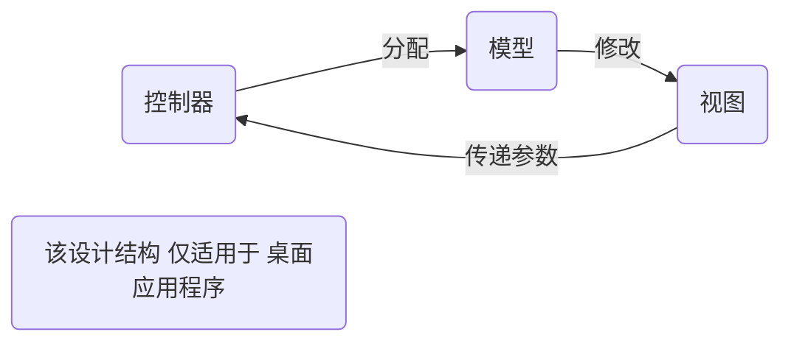
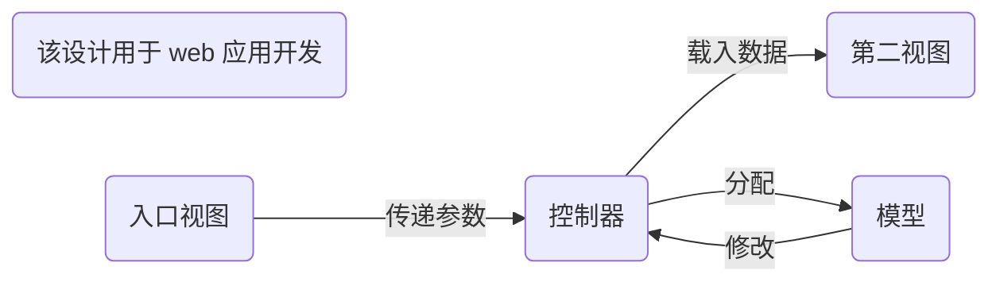

# JSP 与 MVC 设计

## JSP

### 包引入( import )

```jsp
<% page import="java.io" %>
```

### JSP 代码 描述

JSP 代码 主题结构与 HTML 差异不大,对于其中使用 JAVA 的代码 ,需要使用`<% %>`括起来使用.

示例:

```jsp
<%@ page import="java.sql.SQLOutput" %><% -- 注释: 引入Sql 语法支持--%>
```

---

## MVC

mvc : 即 模型（Model）、视图（View）、控制器（Controller）三构件架构.



mvc 2 号架构:



> 对于 mvc 2 号架构 :
>
> 其中 控制器 由 `servlet` 实现
>
> 模型 由 `JavaBean`实现
>
> 视图 是 `jsp`

在一个 web 程序里,控制器负责程序的请求管理.

控制器根据对应的请求调用不同的数据模型或者返回视图.

---

## Java 基本注解

JDK5开始，java增加了对元数据（描述数据属性的信息）的支持.

### **@Override**

#### 限定重写方法

当子类重写父类方法时，子类可以加上这个注解;这可以确保子类确实重写了父类的方法，避免出现低级错误

---

### @Deprecated

#### 标示已过时

用于表示某个程序元素类，方法等已过时，当其他程序使用已过时的类，方法时编译器会给出警告

---

### @SuppressWarnings

#### 抑制编译器警告

被该注解修饰的元素以及该元素的所有子元素取消显示编译器警告;

例如修饰一个类，那他的字段，方法都是取消显示警告

> 该注解具有参数列表

---

### @SafeVarargs

#### 屏蔽堆污染警告

当一个类方法种使用了泛型数据,又使用了可变参数数据时,编译器会发出报错警告(unchecked警告),使用该注解可以屏蔽该警告

>@SafeVarargs注解，对于非static或非final声明的方法，不适用，会编译不通过

---

### @Functionallnterface

#### 限制抽象接口方法

使用该注解的接口,只能拥有一个抽象方法

---

## spring Boot

---

## 注解

是以**@**开头关键字,具有一种语义作用,以看作是对 一个 类/方法 的一个扩展的模版，每个 类/方法 按照注解类中的规则，来为 类/方法 注解不同的参数，在用到的地方可以得到不同的 类/方法 中注解的各种参数与值

示例:`@ResponseBody`,``@GetMapping("/url")`等

> Spring Boot 项目开发,开发状态建议开启热重载,这样就可以避免每次在文件修改后对项目的再次编译 !

----

### @ResponseBody

该关键字会将接口返回值作为内容打印在页面上

> 仅可用于 **接口方法**

- 注解依赖 > `import org.springframework.web.bind.annotation`

---

### @GetMapping

这是一个带有参数的url匹配关键字,其参数是一个路径或者一种操作的命令

> 仅可用于 **接口方法**

- 注解依赖 > `import org.springframework.web.bind.annotation`

---

### @RequestPatam

这是一个带参的 属性 匹配关键字,其参是一个变量名

使用该关键字进行标识,可以让参数接收`POST`数据,反之默认是`GET`数据

> 仅可用于 接口方法**参数**

示例:`@RequestParam("name") String name`

- 注解依赖 > `import org.springframework.web.bind.annotation`

---

### @Controller

这是一个控制器类的关键字,使用该关键字,可以标识当前类为控制器

> 仅可用于 **接口类**
>
> 该注解适用于 **一体化开发|MVC开发**

- 注解依赖 > `import org.springframework.stereotype.Controller;`

---

### @RestController

@RestController 是 @Controller 和 @ResponseBody 两个注解的结合体,即同时具有这两个注解的用法

> 仅可用于 **接口类**
>
> 该注解 适用于 **前后端分离项目**,并在该类项目里取代**@Controller**

---

## 接口方法

接口方法需要使用 **注解** 作为关键字,可以定义参数已接收`POST/GET`方式传递的参数

示例:

```java
@GetMappding("/url") @ResponseBody public String reNum(int Id)}{
    return Id>0&&Id<150?Id:32;
}
```

---

## 补充描述 如何创建一个Spring Boot项目

- 选择Spring Initalizr 项目
- 配置项目描述
- 选择项目依赖(web 选择 Spring web)
- 构建 > 运行
- 完成

---

### 项目路径说明

- src 主程序路径

  - main 入口程序路径
    - java   主程序代码
    - resources 程序配置
  - test 测试代码
  - porm.xml  项目依赖管理文件( 此处可以手动配置依赖 )
